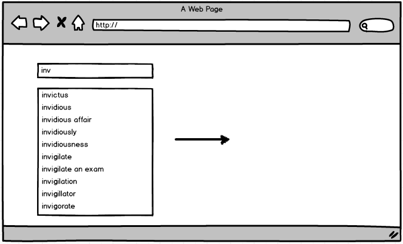
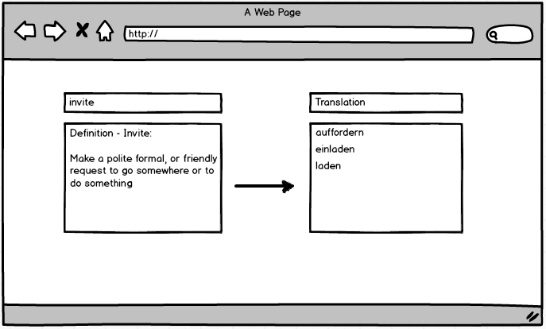

# autotranslate
The lightning-fast translation app from [fourloops](https://github.com/fourloops).

## What?
This will be a dictionary app with a text box in which the user can type a word. The app will show autocomplete suggestions for what the user has typed, and the user will be able to select one of these:

When the user selects a word, they will be shown a range of possible translations in the target language. These will appear on the right side of the screen:

## Why?
To create a user-friendly interface for translating English words.

## How?
We will set up a server using Node and send requests to implement the autocomplete feature. This will involve using a dictionary file with all possible words that the user can type.

We will also use a translation API to fetch translations for the words that the user selects.

We will use TDD throughout, using tape and Istanbul for the back-end, and Jasmine for the front-end.

The project will also be deployed to Heroku.

## Stretch Goals

* Ability to transate into multiple languages
* Audio (pronunciations) for foreign languages
